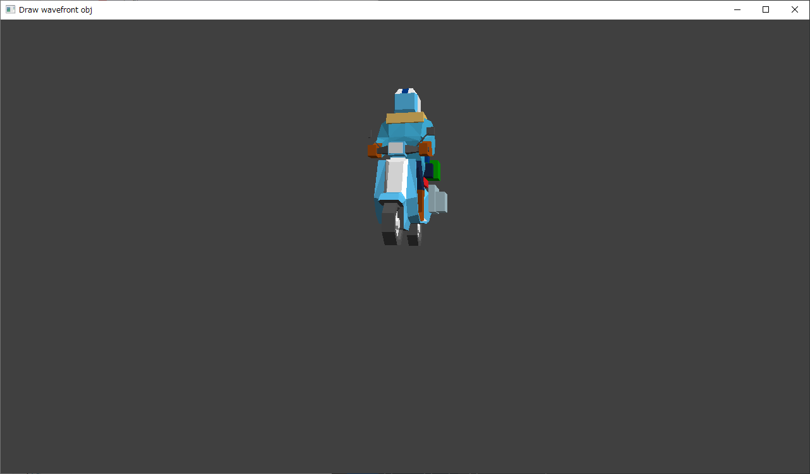
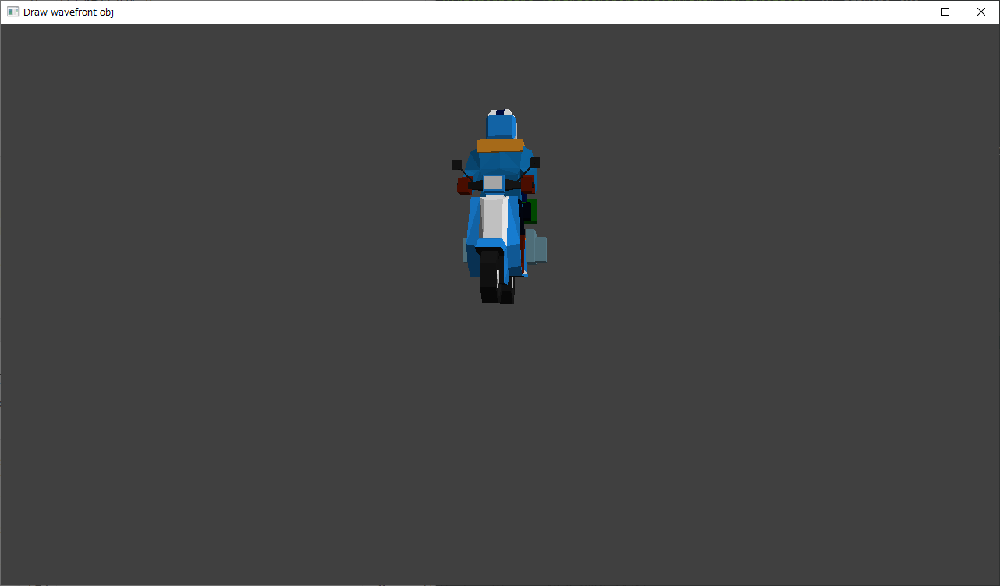

<!-- -*- encoding: utf-8 -*- -->

pyobj2c
=======

Python script to convert wavefront obj files to c header files.

Description
-----------

Blender から Wavefront形式(.obj .mtl) でエクスポートした3Dモデルデータファイルを、C言語のソースにincludeできるヘッダファイルの形に変換するPythonスクリプト。

Screenshots
-----------

以下は、ガンマ補正済みのデータを利用した場合。



以下は、ガンマ補正無しのデータを利用した場合。



Environment
-----------

* Windows10 x64 22H2
* Python 3.10.10 64bit

サンプルソースのコンパイルには MinGW もしくは MSYS2 が必要。
[sample\_src](./sample_src/) を参照のこと。

Usage
-----

```
python pyobj2c.py INPUT.obj > OUTPUT.h
python pyobj2c.py --nogamma INPUT.obj > OUTPUT.h
```

* デフォルト状態ではRGB値(.mtl内の Kd値)に対しガンマ補正を行って、blender 上の見た目と同じ色合いにして出力する。
* --nogamma をつけて実行するとガンマ補正を行わずにRGB値を出力する。その場合、全体的に色が暗くなる。

### 生成されるヘッダファイルについて

生成されたヘッダファイルには以下が含まれる。例えば hoge.obj を読み込ませた場合、以下の名前の配列が作成される。

* const float hoge_obj_vtx[] ... 頂点配列。1つにつき、{x, y, z} を持つ。
* const float hoge_obj_nml[] ... 法線情報配列。１つにつき、{x, y, z} を持つ。
* const float hoge_obj_uv[] ... テクスチャ座標配列。１つにつき、{x, y} を持つ。
* const float hoge_obj_col[] ... 頂点カラー配列。1つにつき、{r, g, b, a} を持つ。
* const unsigned int hoge_obj_vtx_size ... 頂点配列の個数
* const unsigned int hoge_obj_nml_size ... 法線情報配列の個数
* const unsigned int hoge_obj_uv_size ... テクスチャ座標配列の個数
* const unsigned int hoge_obj_col_size ... 頂点カラー配列の個数

OpenGL 1.1 の glDrawArrays() を使って描画することを前提にした配列になっている。

ちなみに、頂点カラーについては、マテリアル情報(.mtl)の Kd (Diffuse color)だけを取り出して頂点カラーにしている。

### C言語から利用

C言語のソース側から利用する場合は以下のような形になる。
```c
#include "hoge.h"

// ...

glEnable(GL_CULL_FACE);
glCullFace(GL_BACK);

// 利用したい情報を有効化
glEnableClientState(GL_VERTEX_ARRAY);
glEnableClientState(GL_TEXTURE_COORD_ARRAY);
glEnableClientState(GL_NORMAL_ARRAY);
glEnableClientState(GL_COLOR_ARRAY);

// 頂点配列等を指定
glVertexPointer(3, GL_FLOAT, 0, hoge_obj_vtx);
glTexCoordPointer(2, GL_FLOAT, 0, hoge_obj_uv);
glNormalPointer(GL_FLOAT, 0, hoge_obj_nml);
glColorPointer(4, GL_FLOAT, 0, hoge_obj_col);

// 頂点配列を使って描画
glDrawArrays(GL_TRIANGLES, 0, hoge_obj_vtx_size);

// 利用していた情報を無効化
glDisableClientState(GL_COLOR_ARRAY);
glDisableClientState(GL_NORMAL_ARRAY);
glDisableClientState(GL_TEXTURE_COORD_ARRAY);
glDisableClientState(GL_VERTEX_ARRAY);
```

License
-------

CC0 / Public Domain


Author
------

[mieki256](https://github.com/mieki256)


